---

### 👤 About

M.Sc. graduate in Communication Systems and Networks from TH Koeln (GPA 1.7, DAAD STIBET scholarship), based in Cologne, Germany. Background covers cloud infrastructure, on-premise systems administration, Active Directory, network engineering, and security operations, built through academic projects, personal labs, and an internship at Detecon International (Deutsche Telekom).

Master's research background includes generative ML benchmarking with TensorFlow and two peer-reviewed publications. This combination of infrastructure depth and ML research experience is an asset for modern cloud and AI-heavy workloads.

Actively building hands-on projects and studying for AZ-104 and CompTIA Security+. Every project documented from the start, including failures and fixes.

**Seeking roles in:** IT Administration, Systems Administration, Cloud Administration, IT Infrastructure, Application Support, Cloud Engineering, DevOps, or any related IT position.

| | |
|---|---|
| 📍 **Location** | Cologne, Germany |
| 🗓 **Notice period** | 2 weeks |
| 🇩🇪 **German** | B1, actively working towards B2 |
| 🇬🇧 **English** | C1 |
| 🔄 **Relocation** | Possible within Germany |

---

### 🔗 Connect

---

### 🧱 Infrastructure, Cloud and Programming Skills

---

### 📊 My Current Status

Building hands-on projects continuously. Each repo has a troubleshooting document because nothing works the first time, and writing it down is part of the learning.

---

### 🏅 Certifications and Achievements

#### 📜 Certifications

| Certification | Issuer | Earned | Verify |
|---|---|---|---|
| ✅ Microsoft Certified: Azure Fundamentals (AZ-900) | Microsoft | May 13, 2026 | [View credential](https://learn.microsoft.com/api/credentials/share/en-us/RubaiyaKabirPranti-9870/D7BB95205F89A886?sharingId=540EF4559245D902) |
| 🔄 AZ-104: Azure Administrator | Microsoft | In progress | |
| 🔄 CompTIA Security+ | CompTIA | In progress | |

#### 🎓 Academic Recognition

| Award | Institution | Detail |
|---|---|---|
| 🏆 DAAD STIBET Scholarship | TH Koeln | Master's thesis research funding |
| 🎯 GPA 1.7 | TH Koeln | M.Sc. Communication Systems and Networks |
| 🥇 Dean's List | BRAC University, Bangladesh | B.Sc. Electrical and Electronics Engineering |
| 🏅 Talentplus Scholarships | Multiple | Awarded across undergraduate studies |
| 📄 Elsevier Publication (2025) | CECAD Research Center, Cologne | Computer vision for mitochondria segmentation |

#### 🎮 GitHub Badges

---

### 💼 Experience

#### 🏢 Detecon International (Deutsche Telekom) - Working Student

Hands-on with multi-cloud environments and Terraform across GCP, AWS, and Azure. Exposure to real production infrastructure workflows at scale inside a Deutsche Telekom subsidiary.

#### 🔬 CECAD Research Center, University of Cologne - Student Research Assistant

Computer vision project for mitochondria segmentation from microscopy images. Built a Python GUI for the analysis workflow. Work led to a peer-reviewed Elsevier publication (2025). [View paper](https://www.sciencedirect.com/science/article/pii/S1746809425002733)

---

### 📁 Projects and Repositories

> Building projects that map to real job goals, not tutorial clones.

| Project | Stack | What it solves |
|---|---|---|
| ☁️ [**azure-iac-foundation**](https://github.com/rubak714/azure-iac-foundation) | Azure · Bicep · RBAC · Policy · PowerShell | Azure landing zone for a fictional German SME (Hessler Logistik GmbH). Naming convention, mandatory tags, RBAC with least privilege, Azure Policy guardrails. AZ-104 aligned. Built alongside AZ-104 study, step by step. |
| 🏗️ [**enterprise-helpdesk-ad-lab**](https://github.com/rubak714/enterprise-helpdesk-ad-lab) | AD DS · osTicket · Linux · Prometheus · Ansible | Simulated company IT environment covering identity, helpdesk, servers, monitoring, automation and security as one integrated system |
| 🚀 [**devops-production-platform**](https://github.com/rubak714/devops-production-platform) | Docker · K8s · Terraform · GKE · Prometheus | Dockerized Flask on Kubernetes with HPA auto-scaling, Terraform GKE on GCP, Prometheus and Grafana via Helm, GitHub Actions CI/CD, load tested with incident response runbooks |
| ⚙️ [**DevOps-Projects-K8s-Terraform-Helm-GCP-CI-CD**](https://github.com/rubak714/DevOps-Projects-K8s-Terraform-Helm-GCP-CI-CD) | K8s · Terraform · Helm · GCP · Actions | 128 commits of working infrastructure code across GitHub Actions pipelines, Kubernetes with Helm, Terraform GCP provisioning |
| 🎓 [**Master-s-Projects-at-German-University**](https://github.com/rubak714/Master-s-Projects-at-German-University) | Python · TensorFlow · Networking | Applied IT, cloud, networking and multi-tier systems from M.Sc. at TH Koeln |
| 📄 [**All-Certifications**](https://github.com/rubak714/All-Certifications) | | Cloud, networking and IT certifications with proof |

---

### 🏭 Recent Project: Enterprise IT Lab

---

### 🛠️ Tech Stack

**🔐 Identity, Directory and Microsoft**

**☁️ Cloud Platforms and IaC**

**🖥️ Systems and Networking**

**🔒 Security and SOC**

**📈 Monitoring and Observability**

**📦 Containers and CI/CD**

**💻 Scripting and Programming**

**🗄️ Databases**

**🤖 Machine Learning and AI (Academic Background)**

**🤝 Collaboration and Support Tools**

---

### ⚡ Recent Activity

- ☁️ Started **[azure-iac-foundation](https://github.com/rubak714/azure-iac-foundation)** - Azure landing zone for Hessler Logistik GmbH, AZ-104 aligned `2026-05-17`
- 🏅 Earned **Microsoft Certified: Azure Fundamentals (AZ-900)** `2026-05-13`
- ⭐ Starred **[TheDevOpsHub/AZ-104](https://github.com/TheDevOpsHub/AZ-104)** `2026-05-01`
- 📦 Pushed to **[rubak714/rubak714](https://github.com/rubak714/rubak714)** `2026-05-17`
- ⭐ Starred **[Azure-Samples/azure-ad-workload-identity](https://github.com/Azure-Samples/azure-ad-workload-identity)** `2026-04-17`

---

