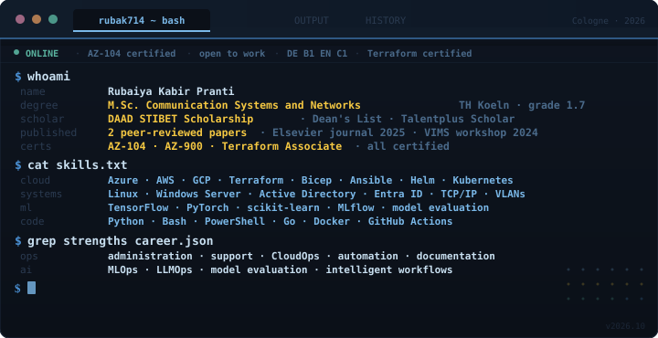
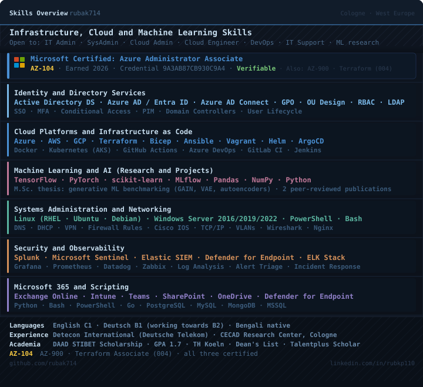

---

### 👤 About

**I keep systems running, and I understand the AI that is moving into them.**

Most people come from one side, operations or machine learning. I have worked on both. As an intern at **Detecon International (Deutsche Telekom)** I worked in a Kubernetes network automation lab and with Terraform across three clouds. As a research intern at the **CECAD Research Center (University of Cologne)** I helped build the interface of an AI image-analysis tool and became second author of the journal article that followed. My M.Sc. in Communication Systems and Networks at TH Köln (final grade 1.7, thesis 1.5, DAAD STIBET scholarship) joins the two: networks and systems in the coursework, machine learning in the thesis.

That puts me at the intersection of **CloudOps, MLOps and LLMOps**:

- **Operations:** Azure administration (AZ-104 certified), identity and access, networking, monitoring and backup, helpdesk and ticketing workflows, infrastructure as code with Terraform.
- **AI:** benchmarking and evaluating models, MLflow pipelines, prompt versioning, AI agents and the Model Context Protocol (MCP) in my daily work.
- **What connects them:** automation, measurement and documentation. Every project here records what failed and how it was fixed.

#### 💡 Why me

A ticket queue, a cloud subscription and a machine learning pipeline fail for the same reasons: unclear ownership, missing monitoring, and changes nobody wrote down. I have learned to handle these from both directions.

On the operations side I manage users, access, networks and servers, and I stay with a problem until it is closed. On the AI side I know how models are trained, evaluated and deployed, so I can tell where an intelligent workflow will help a team and where it will only add risk.

A team that brings me in gets one person who can run the day-to-day operations and also bring AI into them with care.

| Area | What I do | Evidence |
|---|---|---|
| ☁️ **Cloud operations (CloudOps)** | Azure administration, identity and access, networking, monitoring and backup, infrastructure as code | AZ-104, AZ-900, Terraform Associate, [azure-system-administration](https://github.com/rubak714/azure-system-administration), [ephemeral-environments-on-aws](https://github.com/rubak714/ephemeral-environments-on-aws) |
| 🖥️ **IT administration and support** | Active Directory, Microsoft 365, Windows Server and Linux, helpdesk and ticketing | [enterprise-helpdesk-ad-lab](https://github.com/rubak714/enterprise-helpdesk-ad-lab) |
| 🌐 **Networks** | Routing, switching, VLANs, network automation | M.Sc. Communication Systems and Networks, five Cisco Networking Academy courses, Detecon network automation lab |
| 🧪 **MLOps and LLMOps** | Experiment tracking, model registration, prompt versioning, CI for ML code, AI agents and MCP | [azure-mlops-llmops-platform](https://github.com/rubak714/azure-mlops-llmops-platform), [fairness-audit-ai](https://github.com/rubak714/fairness-audit-ai) |
| 🤖 **Machine learning research** | Benchmarking and evaluation of ML methods, generative models | M.Sc. thesis (grade 1.5), 2 peer-reviewed publications |

| | |
|---|---|
| 📍 **Location** | Cologne, Germany |
| 🗓 **Notice period** | 2 weeks |
| 🇩🇪 **German** | B1, actively working towards B2 |
| 🇬🇧 **English** | C1 |
| 🔄 **Relocation** | Possible within Germany |

---

### 🔗 Connect

---

### 🧱 Infrastructure, Cloud and Machine Learning Skills

---

### 📊 My Current Status

Building hands-on projects continuously. Each repo has a troubleshooting document because nothing works the first time, and writing it down is part of the learning.

---

### 🏅 Certifications and Achievements

#### 📜 Certifications

**☁️ Cloud and Infrastructure as Code** (industry certification exams)

| Certification | Issuer | Earned | Verify |
|---|---|---|---|
| ✅ Microsoft Certified: Azure Administrator Associate (AZ-104) | Microsoft | Aug 2026 | [View credential](https://learn.microsoft.com/api/credentials/share/en-us/RubaiyaKabirPranti-9870/9A3AB87CB930C9A4?sharingId=540EF4559245D902) |
| ✅ HashiCorp Certified: Terraform Associate (004) | HashiCorp | Jun 2026 | [View badge](https://www.credly.com/badges/4cbcf82b-53d2-4b27-b8a3-acea9ab9c0d6) |
| ✅ Microsoft Certified: Azure Fundamentals (AZ-900) | Microsoft | May 13, 2026 | [View credential](https://learn.microsoft.com/api/credentials/share/en-us/RubaiyaKabirPranti-9870/D7BB95205F89A886?sharingId=540EF4559245D902) |

**🌐 Networking and Security** (Cisco Networking Academy at TH Köln, instructor-led courses with course completion certificates)

| Course | Covers | Completed |
|---|---|---|
| 📘 CCNAv7: Enterprise Networking, Security, and Automation | OSPF, ACLs, NAT, WAN, QoS, network automation | Jul 2022 |
| 📘 CCNAv7: Switching, Routing, and Wireless Essentials | VLANs, inter-VLAN routing, STP, EtherChannel, WLAN, static routing | May 2022 |
| 📘 CCNAv7: Introduction to Networks | IPv4 and IPv6 addressing, Ethernet, routers and switches, small network security | Jan 2021 |
| 📘 DevNet Associate | Python, REST APIs, Linux, application deployment and network automation | Mar 2023 |
| 📘 Cybersecurity Essentials | Confidentiality, integrity, availability, threats and countermeasures | Nov 2020 |

The three CCNAv7 courses together are the full CCNA curriculum.

**🟧 AWS Partner Training** (one-day classroom trainings during the Detecon internship)

| Training | Completed |
|---|---|
| 📗 AWS Partner: Machine Learning on AWS (Technical) | Mar 2023 |
| 📗 AWS Partner: AWS Cloud Practitioner Essentials | Oct 2022 |
| 📗 AWS Partner: Containers on AWS (Technical) | Sep 2022 |

**🐍 Programming, Data, Machine Learning and DevOps** (online courses with completion certificates)

| Course | Provider | Completed | Verify |
|---|---|---|---|
| 📙 GCP DevOps Project | KodeKloud | Feb 2024 | |
| 📙 Image Noise Reduction with Auto-encoders using TensorFlow (guided project) | Coursera Project Network | Mar 2023 | [Verify](https://coursera.org/verify/M8GAUK66X27B) |
| 📙 Python Entry-Level Programmer (PCEP-30-02) preparation course | KodeKloud | Mar 2023 | |
| 📙 Object-Oriented Programming in Python | DataCamp | Oct 2022 | |
| 📙 Data Analysis with Python | IBM via Coursera | Jan 2022 | [Verify](https://coursera.org/verify/24NW2WXU6SFZ) |
| 📙 Building Deep Learning Applications with Keras 2.0 | LinkedIn Learning | Jan 2022 | |
| 📙 Fake News Detection with Machine Learning (guided project) | Coursera Project Network | Jan 2022 | [Verify](https://coursera.org/verify/KJ73N5LYCVQS) |
| 📙 Breast Cancer Prediction Using Machine Learning (guided project) | Coursera Project Network | Jan 2022 | [Verify](https://coursera.org/verify/PCTGUYQJGXQT) |
| 📙 Full Stack Web Development | Shikhbe Shobai | Oct 2020 | |
| 📙 Programming for Everybody (Getting Started with Python) | University of Michigan via Coursera | Aug 2020 | |

Certificate files are collected in [All-Certifications](https://github.com/rubak714/All-Certifications).

#### 🎓 Academic Record

| Item | Where | Detail |
|---|---|---|
| 🎯 Final grade 1.7, thesis 1.5 | TH Köln | M.Sc. Communication Systems and Networks |
| 📄 Journal article (2025), second author | Biomedical Signal Processing and Control (Elsevier) | MitoSkel: AI tool for segmentation of mitochondria from light microscopy images. [View paper](https://doi.org/10.1016/j.bspc.2025.107762) |
| 📄 Workshop paper (2024), first author | VIMS Workshop Proceedings, TH Köln | Comparison of Missing Data Imputation Techniques using Autoencoders. [View paper](https://doi.org/10.57684/COS-1240) |
| 🏆 DAAD STIBET graduation scholarship | TH Köln | Awarded by a selection committee, 2024 |
| 🥇 Dean's List 2016 | MIST, Bangladesh | B.Sc. Electrical, Electronic and Communication Engineering |
| 🏅 Talentpool Scholarships | Multiple | Awarded across school and college studies |
| 👩‍💻 IEEE Women in Engineering | IEEE | Member in good standing, 2019 certificate of membership |

#### 🎮 GitHub Badges

---

### 💼 Experience and Research

#### 🎓 TH Köln - Master's Thesis Research (2024 - 2025)

Benchmarked seven imputation methods on Demographic and Health Surveys data, including the generative models GAIN and VAE, with survey-disjoint cross-validation to prevent data leakage. Thesis grade 1.5. An earlier research project on the same question became a first-author workshop paper. [View paper](https://doi.org/10.57684/COS-1240)

#### 🔬 CECAD Research Center, University of Cologne - Research Intern

Image annotation and a Python GUI for mitochondria segmentation from microscopy images. Second author of the resulting peer-reviewed article (Elsevier, 2025). [View paper](https://doi.org/10.1016/j.bspc.2025.107762)

#### 🏢 Detecon International (Deutsche Telekom) - Internship

Kubernetes tasks in a network automation lab (AI/MLOps epic), Python test automation, and Terraform on GCP, AWS and Azure, including a self-initiated Terraform task.

---

### 📁 Projects and Repositories

> Projects built end to end and documented, from IT administration and cloud infrastructure to machine learning evaluation.

#### ⭐ Featured Projects

| Project | Stack | What it solves |
|---|---|---|
| 🏗️ [**ephemeral-environments-on-aws**](https://github.com/rubak714/ephemeral-environments-on-aws) | AWS · Terraform · GitHub Actions (OIDC) · Lambda · API Gateway · DynamoDB | Every pull request gets its own isolated AWS environment. Terraform provisions it, an integration test runs against it, the live URL is posted as a PR comment, and everything is destroyed when the PR closes. No stored AWS credentials. |
| ☁️ [**azure-system-administration**](https://github.com/rubak714/azure-system-administration) | Azure Portal · Entra ID · RBAC · VNets · VM Scale Sets · Monitor · Key Vault | Seven hands-on Azure administration labs: one per AZ-104 exam domain, a Key Vault lab and an end-to-end capstone. Each lab has a break-it-and-fix-it exercise and the matching Azure CLI commands. |

#### 📂 More Projects

| Project | Stack | What it solves |
|---|---|---|
| 🏗️ [**enterprise-helpdesk-ad-lab**](https://github.com/rubak714/enterprise-helpdesk-ad-lab) | AD DS · osTicket · Linux · Prometheus · Ansible | Simulated company IT environment covering identity, helpdesk, servers, monitoring, automation and security as one integrated system |
| 🗄️ [**azure-data-platform-terraform**](https://github.com/rubak714/azure-data-platform-terraform) | Terraform · Azure (ADLS Gen2, Key Vault) · GitHub Actions | Azure data platform as reusable Terraform modules, deployed through a CI/CD pipeline |
| 🧪 [**azure-mlops-llmops-platform**](https://github.com/rubak714/azure-mlops-llmops-platform) | Python · MLflow · scikit-learn · GitHub Actions | ML pipeline with experiment tracking, a model registration threshold, prompt versioning for a summarisation task, and CI with pytest and flake8 |
| 🤖 [**fairness-audit-ai**](https://github.com/rubak714/fairness-audit-ai) | Python · scikit-learn · LLM evaluation | Fairness metrics (statistical parity, disparate impact, equal opportunity) and a counterfactual probe that checks whether a language model's answer changes when gendered terms are swapped |
| ⚙️ [**DevOps-Projects-K8s-Terraform-Helm-GCP-CI-CD**](https://github.com/rubak714/DevOps-Projects-K8s-Terraform-Helm-GCP-CI-CD) | K8s · Terraform · Helm · GCP · Actions | 128 commits of working infrastructure code across GitHub Actions pipelines, Kubernetes with Helm, Terraform GCP provisioning |
| 🎓 [**Master-s-Projects-at-German-University**](https://github.com/rubak714/Master-s-Projects-at-German-University) | Python · TensorFlow · Networking | Applied IT, cloud, networking and multi-tier systems from M.Sc. at TH Köln |
| 📄 [**All-Certifications**](https://github.com/rubak714/All-Certifications) | | Cloud, networking and IT certifications with proof |

---

### 🛠️ Tech Stack

**🔐 Identity, Directory and Microsoft**

**☁️ Cloud Platforms and IaC**

**🖥️ Systems and Networking**

**🤖 Machine Learning and AI (Research and Projects)**

**🔒 Security and SOC**

**📈 Monitoring and Observability**

**📦 Containers and CI/CD**

**💻 Scripting and Programming**

**🗄️ Databases**

**🤝 Collaboration and Support Tools**

---

### ⚡ Recent Activity

- 🏅 Earned **[Microsoft Certified: Azure Administrator Associate (AZ-104)](https://learn.microsoft.com/api/credentials/share/en-us/RubaiyaKabirPranti-9870/9A3AB87CB930C9A4?sharingId=540EF4559245D902)** `2026-08`
- 🏅 Earned **[HashiCorp Certified: Terraform Associate (004)](https://www.credly.com/badges/4cbcf82b-53d2-4b27-b8a3-acea9ab9c0d6)** `2026-06`
- ☁️ Updated **[azure-system-administration](https://github.com/rubak714/azure-system-administration)** - seven hands-on Azure administration labs `2026-07-16`
- 🏗️ Updated **[ephemeral-environments-on-aws](https://github.com/rubak714/ephemeral-environments-on-aws)** - a fresh AWS environment for every pull request `2026-07-12`
- 🤖 Published **[fairness-audit-ai](https://github.com/rubak714/fairness-audit-ai)** - fairness metrics and a counterfactual probe for language models `2026-07`
- 🧪 Published **[azure-mlops-llmops-platform](https://github.com/rubak714/azure-mlops-llmops-platform)** - MLflow tracking and prompt versioning `2026-05`
- 🏅 Earned **Microsoft Certified: Azure Fundamentals (AZ-900)** `2026-05-13`
- 📦 Pushed to **[rubak714/rubak714](https://github.com/rubak714/rubak714)** `2026-05-17`
- ⭐ Starred **[Azure-Samples/azure-ad-workload-identity](https://github.com/Azure-Samples/azure-ad-workload-identity)** `2026-04-17`

---

